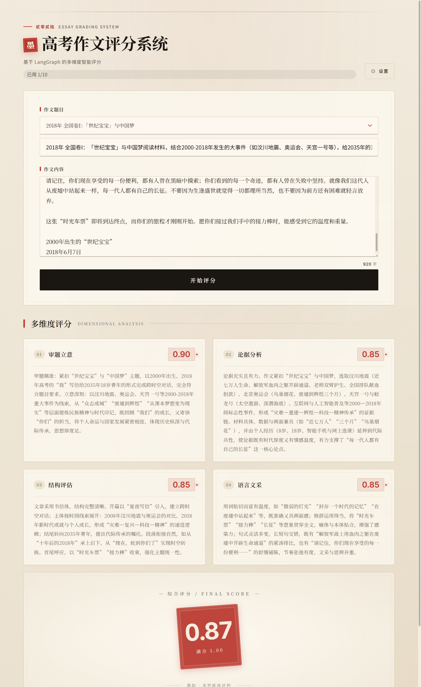

# 作文评分智能体 | Essay Grading Agent

基于 LangGraph 的多维度智能评分系统，对高考作文进行审题立意、论据分析、结构评估、语言文采四维度评分。**纯前端实现，部署在 GitHub Pages**。



## 功能特性

### 四维度评分体系

| 维度 | 说明 | 权重 |
|------|------|------|
| 审题立意 | 评估是否准确理解题目，主题是否深刻 | 30% |
| 论据分析 | 评估论据的质量、丰富度与论证深度 | 20% |
| 结构评估 | 评估文章逻辑层次与段落衔接 | 20% |
| 语言文采 | 评估用词、句式、修辞与文采 | 30% |

### 条件短路机制

当「审题立意」得分 ≤ 0.5 时，系统直接跳到最后综合评分，跳过其余三个维度的评估——确保跑题作文不会被过度评分。

### 并行评估

当审题通过时，论据、结构、语言三个维度并行独立评估，效率更高。

### 流式体验

每完成一个维度评分，前端立即更新对应卡片，无需等待全部完成。

## 快速开始（本地开发）

```bash
npm install
npm run dev          # 访问 http://localhost:5173
```

## 使用流程

1. 打开页面，**默认已连通百灵 `Ling-2.6-1T`，可直接跳到第 5 步开始评分**
2. （可选）若需替换 provider，右上角点「设置」，修改 API Key / BaseURL / 模型名
3. 点「测试连接」验证配置正确
4. 点「保存」返回主页
5. 输入作文题目与内容（或从下拉选择内置的历年高考题），点「开始评分」

> **API Key 仅存于浏览器**（默认从打包的 JSON 读取；用户在设置页保存的覆盖值存于 localStorage），不进任何后端。建议使用额度受限的次级 Key。

## 技术架构

```
浏览器 SPA
  ├─ React (UI)
  ├─ React Router (路由)
  ├─ @langchain/langgraph (工作流编排)
  ├─ @langchain/openai (LLM 客户端)
  └─ localStorage (API Key 存储)
       │
       │ HTTPS 直连（无中间代理）
       ▼
   LLM Provider (百灵 / DeepSeek / 智谱 / OpenAI 等 OpenAI 兼容 API)
```

## 部署到 GitHub Pages

1. 在 GitHub 仓库 Settings → Pages → Source 选「GitHub Actions」
2. 推 `main` 分支即触发自动构建与部署
3. 访问 `https://<user>.github.io/<repo>`

构建产物在 `dist/`，由 `actions/deploy-pages` 上传。

## 支持的 LLM Provider

任何 OpenAI 兼容协议的 API 都可以。已在以下 provider 验证：

- 百灵（默认）
- DeepSeek
- 智谱 GLM
- 美团 LongCat
- 魔塔、硅基流动
- 自建 Ollama

**注意**：浏览器直接请求 LLM API，依赖 provider 已配置 CORS 允许 `github.io` 域名。百灵已支持。

## 开发

```bash
npm test              # 跑 Vitest
npm run lint          # ESLint
npm run build         # 类型检查 + Vite 构建
```

## 安全提示

- ⚠️ API Key 一旦填入，任何能访问此浏览器的人都能看到
- ⚠️ 部署到公开 GH Pages 后，访客使用自己的 Key 评分；但若 Key 泄露到日志或源码，会被盗刷
- ✅ 用户在设置页保存的覆盖 Key 仅存 localStorage，不进 git 仓库
- ✅ 建议在 LLM provider 端设置月度额度上限
- ⚠️ 当前仓库已预填演示用的百灵 API Key 到 `src/config/llm-defaults.json`，会随 GH Pages bundle 公开；若你 fork 本项目用于生产，请务必先把 JSON 替换为自己的私有 Key，并在 provider 后台设置月度额度上限

### 额度限制

- 每个浏览器 localStorage 累计只能使用「开始评分」**10 次**（默认 Key 的轻量防刷措施）
- 达到上限后按钮置灰，鼠标悬浮可见「清空浏览器数据可重置」提示
- 配额限制只是客户端降级提醒，**不是**安全边界；真正的安全靠 provider 端设置月度额度上限

## License

MIT
